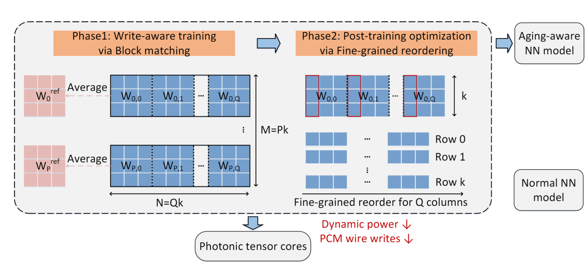
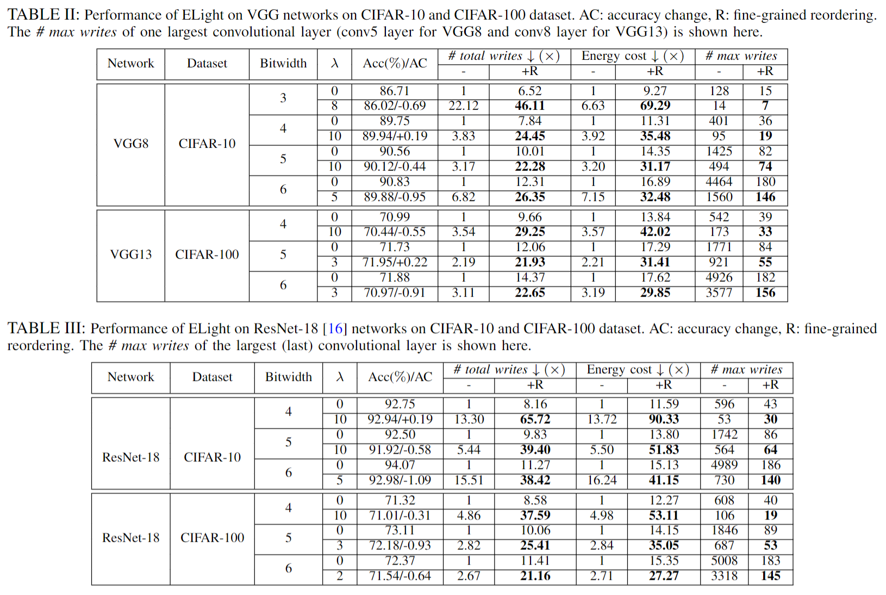

<!--
 * @Author: Hanqing Zhu(hqzhu@utexas.edu)
 * @Date: 1969-12-31 18:00:00
 * @LastEditTime: 2022-04-09 01:46:10
 * @LastEditors: Hanqing Zhu(hqzhu@utexas.edu)
 * @Description: 
 * @FilePath: /projects/ELight/README.md
-->
# ELight
By [Hanqing Zhu](https://github.com/zhuhanqing), [Jiaqi Gu](https://github.com/JeremieMelo), [Chenghao Feng](https://github.com/Fengchenghao1996), Mingjie Liu, Zixuan Jiang, Ray T. Chen and David Z. Pan.

This repo is the official implementation of "ELight: Enabling Efficient Photonic In-Memory Neurocomputing with Life Enhancement"[[Preprint](https://arxiv.org/abs/2112.08512)].
The results in the GitHub are not from the fully-trained model, but from models in early epoches. I will update the results quickly.

# Introduction
**ELight** is a synergistic aging-aware co-optimization framework, aiming at trimming down the needed number of write operations when utilizing the emerging PCM-based photonic neuroengine \[[Nature'21](https://www.nature.com/articles/s41586-020-03070-1) \|\[[APR'20](https://aip.scitation.org/doi/10.1063/5.0001942) \| for inference tasks.
 
 **ELight** contains two phases. Large weight matrices are partitioned into small weight blocks, which are sequentially programmed onto photonic tensor cores to achieve block matrix multiplication.
The proposed write-aware training method considers the dataflow pattern and boosts the block-wise similarities. A post-training fine-reordering technique is proved to be optimal to reduce the number of write operations by reordering weights without influencing the model output.




Besides, to fit the unique transmission distribution of PCM memory cells, a logarithmic quantization is proposed to reduce the matrix multiplication error.

On CIFAR-10/100 and VGG/ResNet, we achieve significant reduce of the write operations.



# Dependencies
* Python >= 3.6
* pyutils >= 0.0.1. See [pyutils](https://github.com/JeremieMelo/pyutility) for installation.
* pytorch-onn >= 0.0.2. See [pytorch-onn](https://github.com/JeremieMelo/pytorch-onn) for installation.
* Python libraries listed in `requirements.txt`
* NVIDIA GPUs and CUDA >= 10.2

# Structures
* core/
    * models/
        * layers/
            * pcm_cov2d and pcm_linear: PCM-based layer definition: support logarithmic quantization
        * vgg.py: PCM-based VGG model
        * model_base.py: base model definition with all model utilities
    * builder.py: build training utilities
* ops/
    * utlis/
        * logarithmic quantization and the differentiable diff loss function
* configs: YAML-based config files
* scripts/: contains experiment scripts
* train.py: training logic of write-aware training
& reorder.py: reorder the weights and give a roughly estimated number of write operations and energy cost

# Usage

* Train an aging-aware model with write-aware training.\
`> python3 train.py configs/cifar10/vgg8/train.yml`

* Reorder the weights and get a roughly estimated number of write operations and energy cost ratio by using the provided sample script `reorder.py`.\
`python3 reorder.py --checkpoint your/checkpoint/path --diff_loss_weight 10 --bits 4`

# Citing ELight
```
@inproceedings{zhu2022elight,
  title={Towards Memory-Efficient Neural Networks via Multi-Level in situ Generation},
  author={Zhu, Hanqing and Gu, Jiaqi and Feng, Chenghao and Liu, Mingjie and Jiang, Zixuan and Chen, Ray T. and Pan, David Z.},
  booktitle={2022 27th Asia and South Pacific Design Automation Conference (ASP-DAC)}, 
  title={ELight: Enabling Efficient Photonic In-Memory Neurocomputing with Life Enhancement}, 
  year={2022},
}
```

# Related Papers
* Hanqing Zhu, Jiaqi Gu, Chenghao Feng, Mingjie Liu, Zixuan Jiang, , Ray T. Chen, and David Z. Pan, "ELight: Enabling Efficient Photonic In-Memory Neurocomputing with Life Enhancement," ASPDAC, 2022. \[[paper](https://ieeexplore.ieee.org/document/9712497) \|
